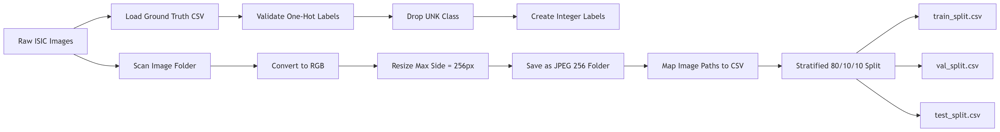
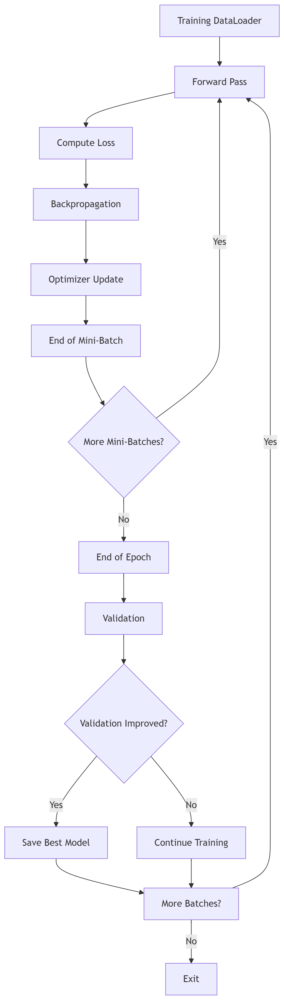
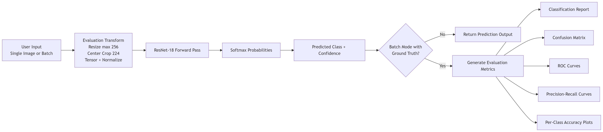

# ICT304-AI-System-Design-Project
Assignment 1 and Final Project for ICT304 AI System Design.

# Requirements
Anaconda with python:3.11 

## Repository structure

```text
ICT304-AI-System-Design-Project/
├── README.md
├── client.py
├── config.py
├── train.py
├── inference_one.py
├── inference_on_file.py
├── pre_process.py
├── results/
│   └── (evaluation plots only)
├── Before_ISIC_0000000.jpg
├── After_ISIC_0000000.jpg
├── .gitignore
└── Isic2019/                          
    ├── ISIC_2019_Training_Input/      (original images) (LOCAL ONLY, not pushed to GitHub)
    ├── resnet18_isic2019_best.pt
    └── ISIC_2019_Training_Input_256/  (preprocessed images) (LOCAL ONLY, not pushed to GitHub)
```
## System Architecture

### Preprocessing Pipeline
<p align="center">
  
</p>

### Training Pipeline
<p align="center">
  
</p>

### Inference Pipeline
<p align="center">
  
</p>
